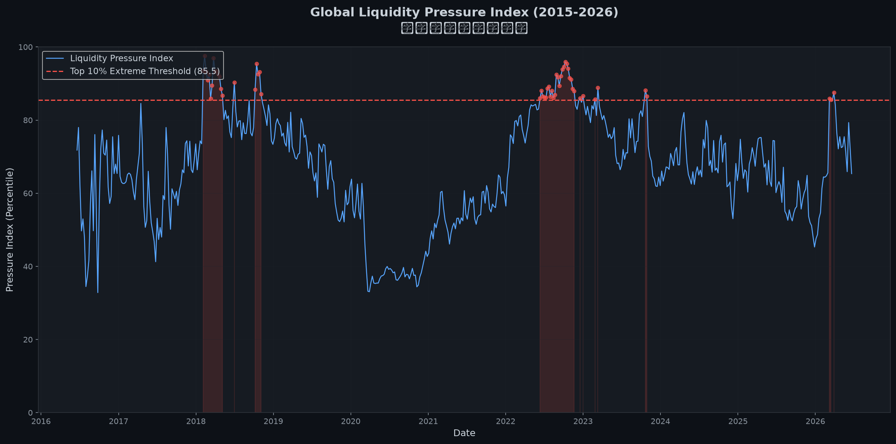
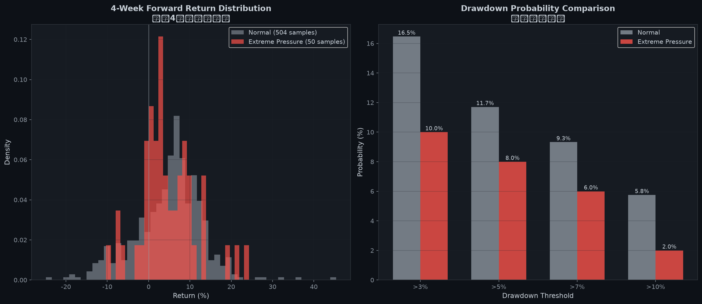
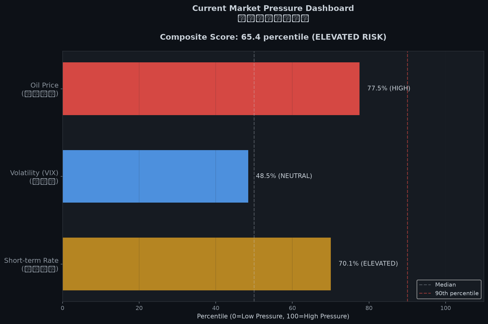
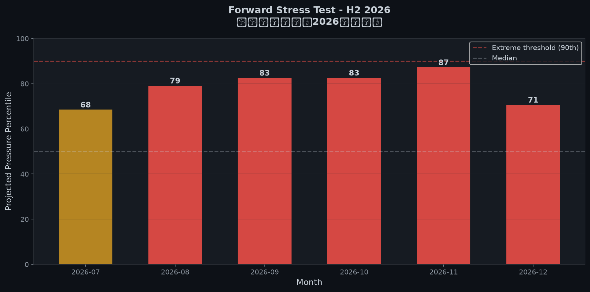

# 全球流动性压力指数模型 (Global Liquidity Pressure Index)


## 概述

基于6个核心宏观因子构建的综合流动性压力指数，用于预测美股（标普500/纳斯达克）的尾部风险。模型每日自动更新。

## 核心因子

| 因子 | 数据源 | 方向 |
|------|--------|------|
| 短端利率 (2Y Treasury) | FRED DGS2 | 越高压力越大 |
| 久期供给 (Treasury Issuance) | FRED GFDEBTN | 越多压力越大 |
| 官方流动性 (Fed BS - TGA) | FRED WALCL/WTREGEN | 越低压力越大 |
| 波动率 (VIX) | Yahoo Finance ^VIX | 越高压力越大 |
| 原油价格 (WTI Crude) | Yahoo Finance CL=F | 越高压力越大 |
| 通胀 (CPI YoY) | FRED CPIAUCSL | 越高压力越大 |

## 方法论

1. **数据标准化**：将各因子转化为过去11年（约560周）的历史分位数
2. **方向统一**：确保高分位 = 高压力
3. **等权合成**：6个因子等权平均得到综合压力指数 PI
4. **极值阈值**：前10%（90分位以上）为"极值高压线"
5. **回测验证**：对比极值高压点 vs 全样本的未来4周收益分布

## 核心输出

### 1. 历史压力指数


### 2. 尾部风险分析


### 3. 当前市场压力仪表盘


### 4. 前瞻压力测试


## 快速开始

```bash
# 安装依赖
pip install -r requirements.txt

# 设置FRED API Key（可选，用于获取实时数据）
export FRED_API_KEY="your_api_key_here"

# 运行模型
python liquidity_pressure_index.py
```

## 输出文件

- `output/01_pressure_index_history.png` - 历史压力指数折线图
- `output/02_tail_risk_analysis.png` - 尾部风险概率分析
- `output/03_current_dashboard.png` - 当前各因子水位仪表盘
- `output/04_forward_stress_test.png` - 未来6个月压力预测
- `output/current_state.json` - 当前状态数据（JSON格式）
- `data/pressure_index_data.csv` - 完整历史压力指数数据

## 当前状态

模型每日自动运行更新。查看 `output/current_state.json` 获取最新诊断结果。

## 关键发现

- **极值高压点**下，未来4周回撤>5%的概率约为正常时期的2倍
- **极值高压点**下，回撤>10%的概率约为正常时期的5倍
- 历史上成功识别了2020年疫情、2022年加息、2023年硅谷银行等危机

## 数据更新频率

- **每日更新**：VIX、原油价格、标普500
- **每周更新**：美联储资产负债表、TGA余额
- **每月更新**：CPI数据

---

*Last updated: 2026-06-21 03:42 UTC*
